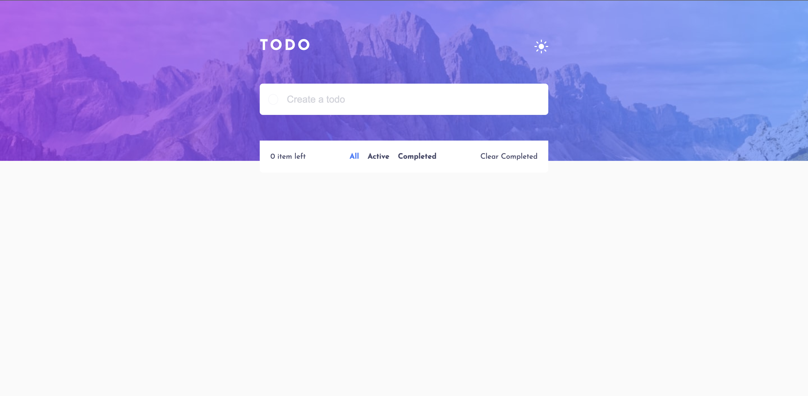

# Frontend Mentor - Todo app solution

This is a solution to the [Todo app challenge on Frontend Mentor](https://www.frontendmentor.io/challenges/todo-app-Su1_KokOW). Frontend Mentor challenges help you improve your coding skills by building realistic projects.

## Table of contents

- [Overview](#overview)
  - [The challenge](#the-challenge)
  - [Screenshot](#screenshot)
  - [Links](#links)
- [My process](#my-process)
  - [Built with](#built-with)
  - [What I learned](#what-i-learned)
  - [Continued development](#continued-development)
  - [Useful resources](#useful-resources)
- [Author](#author)
- [Acknowledgments](#acknowledgments)

**Note: Delete this note and update the table of contents based on what sections you keep.**

## Overview

### The challenge

Users should be able to:

- View the optimal layout for the app depending on their device's screen size
- See hover states for all interactive elements on the page
- Add new todos to the list
- Mark todos as complete
- Delete todos from the list
- Filter by all/active/complete todos
- Clear all completed todos
- Toggle light and dark mode
- **Bonus**: Drag and drop to reorder items on the list

### Screenshot

### Links

- Solution URL: [https://github.com/mrvicthor/angular-todo-app]
- Live Site URL: [https://angular-todo-app-pied.vercel.app/]

## My process

### Built with

- Semantic HTML5 markup
- CSS custom properties
- Flexbox
- Mobile-first workflow
- [Angular](https://angular.io/) - JS framework
- [RxJS]

### What I learned

This project was a means to learn Angular. I learned that Services are a great way to share information among classes that do not know each other. Additionally, I learned how to use reactive forms.

### Continued development

I plan to continue to explore more features of angular and improve my understanding of RxJS.

### Useful resources

- [https://angular.io/docs] - This helped me understand how to create an application in angular.
- [https://rxjs.dev/guide/overview] - This is an amazing website that helped understand how to react to changes within my application.

## Author

- Website - [Victor Eleanya](https://portfolio-six-navy-11.vercel.app/)
- Frontend Mentor - [@mrvicthor](https://www.frontendmentor.io/profile/mrvicthor)
- Twitter - [@eva_skillz](https://twitter.com/eva_skillz)

## Acknowledgments

I will like to acknowledge my senior colleagues and line manager at Vertu Motors for the reviews and feedback. They inspired me to learn this framework.
